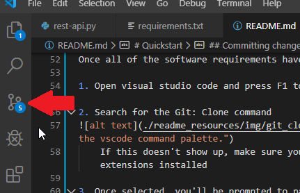
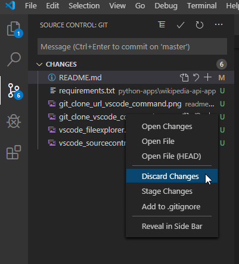
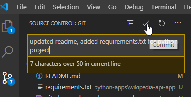
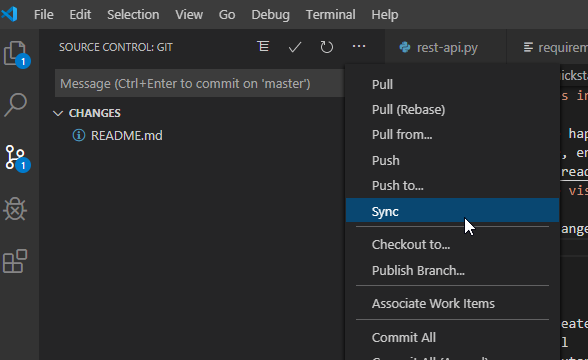

# Introduction

This is the Spring DASC6030 Group 1 repo for their Wikipedia & Textbook Search (name pending)

It currently contains the following projects:

- A python project for performing searches on wikipedia articles
- A python project for providing APIs for external applications
- An angular web application project

# Table of contents

- [Quickstart](#quickstart)
    - [Markdown Information](#markdown-information)
    - [Software Requirements](#software-requirements)
    - [Cloning the repo](#cloning-the-repo)
    - [Committing changes](#committing-changes)
- [Changelog](#changelog)
- [TODO List](#todo-list)

# Quickstart

## Markdown Information
This readme file is written in a format called Markdown.
Markdown is what's normally used for writing the summary of repos you see in github and other repository management systems.

See these links for more on how to use MarkDown:

- https://www.markdownguide.org/basic-syntax
- https://www.markdownguide.org/cheat-sheet

## Software Requirements
In order to compile and execute these projects, you'll need to install the following:

- Git:
    - https://git-scm.com/downloads    
- NodeJS: https://nodejs.org/en/
    - Either the LTS/recommended or current version will work.
    - This will also install npm package manager
    - Node and NPM allow us to quickly install and manage external programming libraries within our projects.
- Python v3.8.1: https://www.python.org/downloads/release/python-381/
- Visual Studio Code: https://code.visualstudio.com/
    - This is Microsoft's newest IDE/code editor.
- Here is a list of extensions that'll be helpful for you while using Visual Studio Code:
    - Azure Repos: https://marketplace.visualstudio.com/items?itemName=ms-vsts.team
    - Git Project Manager: https://marketplace.visualstudio.com/items?itemName=felipecaputo.git-project-manager
    - Python: https://marketplace.visualstudio.com/items?itemName=ms-python.python

## Cloning the repo

Once all of the software requirements have been installed:

1. Open visual studio code and press F1 to open the command palette search.

2. Search for the Git: Clone command

    
    
    If this doesn't show up, make sure you have the Azure Repos and Git Project Manager extensions installed

3. Once selected, you'll be prompted to paste the repository url

    

4. Paste the following URL: https://DASC-Group-1@dev.azure.com/DASC-Group-1/Wikipedia%20And%20Textbook%20Search%20Engine/_git/Wikipedia%20And%20Textbook%20Search%20Engine

5. It will then ask you to select a folder to clone the repo's files to. Select where you want the files to be downloaded to.

6. Once it's complete, vscode will reopen to the cloned directory. You can view the project's files in the file explorer. View the explorer by clicking the double-file icon at the top left of vscode:

    

## Committing changes

If you've made changes that you'd like to push to the branch, you'll want to open the source control window in vscode, add a commit comment, and commit then sync your changes.

1. To open the source control window, click this button in vscode:

    

2. Review the changes you've made in this window. Make sure nothing weird is going on- sometimes you'll see changes to files you don't expect. You can discard or ignore changes you don't want by right-clicking them and choosing to do so:

    

3. Once you're happy with the changes to the files listed in the source control viewer, enter a commit message and click 'Commit':

    

4. Once the changes are committed, sync the changes to the repo in git:

    

5. Your commits should now be synced up to the repository!

# Changelog

- 20200130: Create the repo, angular web app, and some python examples from a tutorial
    - Python tutorial: https://code.visualstudio.com/docs/python/python-tutorial
- 20200217: 
    - Added requirements.txt file for installing necessary python packages
    - Added .gitignore and modified it so the .venv and node_modules folders are ignored by source control
        - This is so the hundreds of files from each are left out of our checkins
        - Our checkin should strictly be dealing with code. Changes to packages should be noted in the requirements.txt file for python and package.json for angular
    - Added Cloning the repo and Committing changes sections to the readme

# TODO List

- Pick a name for this project
    - Forming a brand is the most important part of product development!
- Create a use-case diagram of the software being built
- Implement Feature: Upload and scan PDF file
- Implement Feature: Generate report